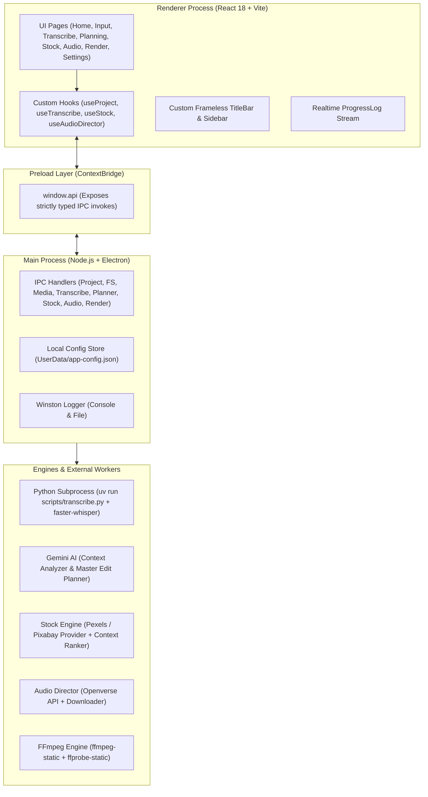
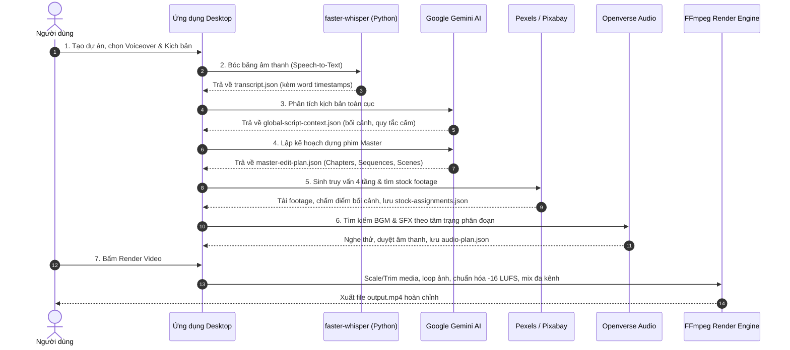

# 🎬 Long-Form AI Video Factory

> **Hệ thống tự động hóa biên tập và sản xuất video tài liệu / phim kể chuyện dài tập (Long-Form Documentary & Storytelling) sử dụng trí tuệ nhân tạo.**

[](https://www.electronjs.org/)
[](https://react.dev/)
[](https://www.typescriptlang.org/)
[](https://vitejs.dev/)
[](https://ai.google.dev/)
[](https://github.com/SYSTRAN/faster-whisper)
[](https://ffmpeg.org/)
[](LICENSE)

---

## 📌 Mục Lục

- [1. Giới Thiệu & Mục Đích](#1-giới-thiệu--mục-đích)
- [2. Các Tính Năng Cốt Lõi](#2-các-tính-năng-cốt-lõi)
- [3. Kiến Trúc Kỹ Thuật (Architecture)](#3-kiến-trúc-kỹ-thuật-architecture)
- [4. Quy Trình Xử Lý Chi Tiết (Pipeline 7 Bước)](#4-quy-trình-xử-lý-chi-tiết-pipeline-7-bước)
- [5. Cấu Trúc Mã Nguồn (Directory Structure)](#5-cấu-trúc-mã-nguồn-directory-structure)
- [6. Cấu Trúc Dữ Liệu Mỗi Dự Án (Project Storage)](#6-cấu-trúc-dữ-liệu-mỗi-dự-án-project-storage)
- [7. Hệ Thống IPC (Inter-Process Communication)](#7-hệ-thống-ipc-inter-process-communication)
- [8. Yêu Cầu Môi Trường & Hướng Dẫn Cài Đặt](#8-yêu-cầu-môi-trường--hướng-dẫn-cài-đặt)
- [9. Khắc Phục Sự Cố (Troubleshooting)](#9-khắc-phục-sự-cố-troubleshooting)

---

## 1. Giới Thiệu & Mục Đích

Sản xuất một video tài liệu hoặc phân tích chuyên sâu dài từ 10 đến 30 phút theo phương pháp thủ công thường đòi hỏi rất nhiều nhân lực và thời gian:
1. Phải nghe và cắt nhỏ file thuyết minh giọng đọc (Voiceover) theo từng câu.
2. Tìm kiếm hàng trăm đoạn footage, hình ảnh minh họa phù hợp trên các kho stock.
3. Ghép cảnh thủ công, chỉnh nhịp chuyển cảnh, đảm bảo tính chân thực lịch sử và bối cảnh địa lý.
4. Lựa chọn nhạc nền phù hợp với từng cung bậc cảm xúc của câu chuyện và chèn âm thanh hiệu ứng (SFX).
5. Render và cân chỉnh âm lượng tổng thể để giọng thuyết minh không bị nhạc nền lấn át.

**Long-Form AI Video Factory** được xây dựng nhằm giải quyết toàn bộ chuỗi công việc trên một cách **tự động, thông minh và đồng bộ**, biến kịch bản dạng chữ (`.txt`) và file giọng đọc thuyết minh (`.mp3`, `.wav`) thành một **video hoàn chỉnh đạt chuẩn phát sóng documentary**.

### Điểm khác biệt mấu chốt
Khác với các công cụ tạo video ngắn đơn giản chỉ dựa vào từ khóa cục bộ, hệ thống này tích hợp **Context-Aware Visual Research Engine (Bộ não nghiên cứu thị giác nhận thức bối cảnh)**:
- Không bao giờ phân tích cảnh quay một cách cô lập.
- Nắm vững toàn bộ bức tranh tài liệu: chủ thể chính, luận đề, niên đại lịch sử, vị trí địa lý, trang phục, các điểm neo bối cảnh và các quy tắc cấm kỵ (như không nhầm lẫn văn hóa Amish với Hutterite, không dùng ảnh thành thị cho bối cảnh nông thôn thế kỷ 19).

---

## 2. Các Tính Năng Cốt Lõi

| Phân Hệ | Công Nghệ Sử Dụng | Tính Năng Nổi Bật |
|---|---|---|
| **Bóc băng giọng đọc (STT)** | `faster-whisper` + `uv` (Python 3.9+) | Nhận diện giọng nói siêu nhanh trên CPU (`int8`), trích xuất thời gian chính xác từng từ (`word_timestamps`), tự động lọc khoảng lặng (VAD). Có cơ chế cache thông minh theo mã băm file. |
| **Phân tích bối cảnh toàn cục** | Google Gemini AI (`@google/genai`) | Phân tích toàn bộ kịch bản để trích xuất thế giới hình ảnh (`GlobalScriptContext`): Nhân vật, niên đại, địa lý, kiến trúc, nghề nghiệp, từ khóa bắt buộc (`exactTopicAnchors`) và từ khóa cấm kỵ (`negativeKeywords`). |
| **Quy hoạch dựng phim AI** | Gemini Prompt Orchestrator | Chia kịch bản thành cấu trúc cây: `Chapters -> Sequences -> Scenes`. Mỗi cảnh được tính toán chính xác thời gian bắt đầu/kết thúc, nhịp cắt, loại chuyển cảnh và gợi ý bố cục khung hình. |
| **Tìm kiếm Stock thông minh** | Pexels API + Pixabay API | Tìm kiếm theo 4 tầng (Tier A: Chính xác, Tier B: Đối tượng, Tier C: Bối cảnh, Tier D: Fallback). Chấm điểm ứng viên theo thang 100 điểm với hệ thống phạt điểm gắt gao khi vi phạm quy tắc bối cảnh. |
| **Đạo diễn âm thanh tự động** | Openverse API + DSP Algorithms | Tự động phân đoạn tâm trạng âm nhạc theo chương, tìm kiếm nhạc nền (BGM) và hiệu ứng tiếng động (SFX) miễn phí bản quyền CC. Cho phép duyệt, nghe thử, chỉnh `volumeDb`, `fadeIn`, `fadeOut`. |
| **Dựng & Xuất Video** | `ffmpeg-static` + `ffprobe-static` | Tự động xử lý tỉ lệ khung hình (16:9, 9:16, 1:1), lặp ảnh tĩnh, cắt video khớp lời, chuẩn hóa âm thanh giọng đọc đạt chuẩn phát thanh (`-16 LUFS`), tự động nén nhỏ nhạc nền (ducking) và chống méo tiếng (`alimiter`). |
| **Giao diện làm việc** | Electron + React 18 + Vanilla CSS | Dark theme chuẩn phòng thu, Custom Frameless TitleBar, nhật ký thời gian thực (Real-time Log Stream), trình duyệt media trực quan với huy hiệu trạng thái (status badges). |

---

## 3. Kiến Trúc Kỹ Thuật (Architecture)

Ứng dụng được thiết kế theo mô hình **Electron Multi-Process Architecture**, phân tách triệt để giữa giao diện người dùng và các tác vụ nặng:



---

## 4. Quy Trình Xử Lý Chi Tiết (Pipeline 7 Bước)



### Bước 1: Khởi Tạo Dự Án & Nạp Dữ Liệu (Inputs)
- Người dùng đặt tên dự án mới -> Ứng dụng tự động khởi tạo cây thư mục chuẩn.
- Nạp file **Voiceover** (`.mp3`, `.wav`) và file **Kịch bản** (`.txt`).
- *(Tùy chọn)* Nạp các thư mục ảnh, video nội bộ để hệ thống quét metadata qua `ffprobe`.

### Bước 2: Bóc Băng Tự Động (Transcription)
- Hàm `transcribeAudio()` gọi tiến trình con `uv run scripts/transcribe.py`.
- Mô hình `faster-whisper` (hỗ trợ `tiny`, `base`, `small`, `medium`, `large-v2/v3`) chạy trên CPU với `compute_type="int8"`.
- Bộ lọc `vad_filter=True` tự động loại bỏ đoạn tĩnh, trả về mảng `segments` với thời gian chính xác từng phần trăm giây (`start`, `end`, `words[]`).
- Dữ liệu được lưu vào `analysis/transcript.json`.

### Bước 3: Phân Tích Bối Cảnh Toàn Cục (Global Script Analysis)
- `global-context-analyzer.ts` gửi toàn bộ kịch bản/transcript lên Gemini.
- Trích xuất:
  - **Chủ thể & Luận đề:** `primarySubject`, `centralThesis`, `documentaryAngle`.
  - **Không - Thời gian:** `geography` (quốc gia, vùng miền), `timeContext` (thời kỳ lịch sử).
  - **Cộng đồng & Con người:** Nhân vật thường trực, trang phục đặc trưng.
  - **Bộ neo bối cảnh:** `exactTopicAnchors` (danh từ riêng bắt buộc), `contextualAnchors` (từ khóa bối cảnh).
  - **Quy tắc bảo vệ:** `forbiddenSubstitutions` (các nhầm lẫn thị giác cấm kỵ), `negativeKeywords` (từ khóa loại trừ khi search).
- Lưu vào `analysis/global-script-context.json`.

### Bước 4: Lập Kế Hoạch Biên Tập Master (AI Edit Planning)
- `planner.ts` kết hợp Transcript và Global Context gửi yêu cầu phân cảnh lên Gemini.
- Gemini chia video thành cấu trúc điện ảnh:
  - **Chapters (Chương):** Khối nội dung lớn theo diễn biến cốt truyện.
  - **Sequences (Phân đoạn):** Các chuỗi hành động cùng một chủ đề nhỏ.
  - **Scenes (Cảnh quay):** Đơn vị hình ảnh khớp theo từng câu thoại (khoảng 3 – 15 giây).
- Mỗi cảnh được gán `startTime`, `endTime`, `duration`, `narrativeText`, `visualIntent`, `searchQueries`.
- Lưu vào `analysis/master-edit-plan.json`.

### Bước 5: Săn Lùng & Khớp Stock Footage (Context-Aware Stock Hunting)
- `context-query-gen.ts` sinh kế hoạch tìm kiếm 4 tầng cho từng scene:
  - **Tier A (Exact):** Danh từ riêng + hành động + địa danh.
  - **Tier B (Subject):** Tên đối tượng + bối cảnh rộng.
  - **Tier C (Contextual):** Mô tả môi trường/nghề nghiệp khi không có footage cụ thể.
  - **Tier D (Fallback):** Hình ảnh mang tính ẩn dụ/minh họa khái niệm.
- Gọi đồng thời API Pexels và Pixabay.
- `context-ranker.ts` chấm điểm ứng viên theo thang 100 điểm:
  - Độ tương đồng với lời thoại & visual intent (30 điểm).
  - Khớp với chủ thể toàn cục (25 điểm).
  - Khớp vị trí địa lý (15 điểm).
  - Khớp thời kỳ lịch sử (10 điểm).
  - Khớp mục tiêu của chương (10 điểm).
  - Chất lượng kỹ thuật 4K/FHD và tỉ lệ khung hình (10 điểm).
  - **Phạt điểm nặng:** Trừ 40–50 điểm nếu chứa `negativeKeywords` hoặc dính vào `forbiddenSubstitutions`.
- Tự động tải ứng viên điểm cao nhất về `assets/stock/`, cho phép người dùng thay thế bằng từ khóa mới, khóa cảnh (lock) hoặc tự tải file từ máy tính lên.

### Bước 6: Đạo Diễn Âm Thanh (Smart Audio Director)
- `audio-director.ts` gộp các cảnh thành các **Section âm nhạc** theo chương và cảm xúc (`mood`).
- Tự động gọi Openverse API tìm kiếm bài hát nhạc cụ phù hợp với nhịp phim tài liệu.
- Phân tích từng cảnh để tìm kiếm hiệu ứng âm thanh (**SFX**) tương ứng với chuyển động (tiếng búa gõ, tiếng vó ngựa, tiếng gió đồng cỏ, tiếng máy nổ...).
- Giao diện trực quan cho phép:
  - Nghe thử trực tiếp bản nhạc / SFX.
  - Duyệt (Approve) hoặc bỏ chọn.
  - Điều chỉnh âm lượng dB (mặc định BGM là `-30 dB`, SFX là `-18 dB`).
  - Thiết lập thời gian Fade In / Fade Out (mặc định 2s – 3s).
- Tải các file đã duyệt về `assets/audio/` và xuất `analysis/audio-plan.json`.

### Bước 7: Dựng & Xuất Video Hoàn Chỉnh (FFmpeg Rendering)
- `renderer.ts` nhận lệnh render qua IPC:
  1. **Render từng Scene thành clip tạm:**
     - Ảnh tĩnh: Dùng bộ lọc `-loop 1`, scale và pad vừa vặn độ phân giải đích (`1920x1080` hoặc cấu hình), render bằng codec `libx264` với tốc độ khung hình chuẩn (FPS).
     - Video stock: Cắt đúng thời lượng `duration`, loại bỏ audio gốc (`-an`), scale & pad.
     - Cảnh thiếu footage: Tự động lót nền đen để không làm đứt đoạn timeline.
  2. **Ghép nối các Scene:** Sử dụng FFmpeg `concat demuxer` ghép liên tục các scene tạm thành `raw_video.mp4`.
  3. **Xử lý âm thanh đa luồng phức tạp (Audio Filter Complex):**
     - Voiceover: Chuẩn hóa âm lượng qua bộ lọc chuẩn phát thanh quốc tế `loudnorm=I=-16:TP=-1.5:LRA=11`.
     - Nhạc nền (BGM): Căn đúng `adelay` theo thời gian bắt đầu của chương, áp dụng âm lượng `volume` và hiệu ứng `afade`.
     - SFX: Căn đúng thời điểm bắt đầu của cảnh tương ứng.
     - Hòa trộn toàn bộ qua `amix`, sau đó đi qua bộ giới hạn chống vỡ tiếng `alimiter=limit=0.891:attack=5:release=50`.
  4. Xuất video thành phẩm ra thư mục `output/<outputName>.mp4` và dọn dẹp toàn bộ file tạm.

---

## 5. Cấu Trúc Mã Nguồn (Directory Structure)

```text
Web-auto-edit/
├── electron-builder.yml            # Cấu hình đóng gói Electron desktop app
├── electron.vite.config.ts         # Cấu hình Vite build cho Main, Preload và Renderer
├── package.json                    # Khai báo dependencies và scripts
├── tsconfig.json                   # Cấu hình TypeScript gốc
├── tsconfig.node.json              # TypeScript cho Electron Main Process
├── tsconfig.web.json               # TypeScript cho Renderer Process (React)
│
├── scripts/
│   └── transcribe.py               # Script Python độc lập (faster-whisper) chạy qua Astral uv
│
├── shared/
│   └── types.ts                    # Toàn bộ Data Models & Typescript Interfaces dùng chung
│
└── src/
    ├── main/                       # ELECTRON MAIN PROCESS (Backend)
    │   ├── index.ts                # Khởi tạo BrowserWindow, vòng đời ứng dụng, nạp IPC
    │   ├── config.ts               # Quản lý cấu hình API Keys (UserData/app-config.json)
    │   ├── logger.ts               # Hệ thống ghi nhật ký Winston
    │   ├── transcriber.ts          # Điều phối worker Whisper và quản lý thư mục model
    │   ├── planner.ts              # Master AI Edit Planner kết nối Google Gemini API
    │   ├── renderer.ts             # FFmpeg Video Rendering & Audio Mixing Engine
    │   │
    │   ├── audio/                  # SMART AUDIO DIRECTOR
    │   │   ├── audio-director.ts   # Phân cụm section nhạc, điều phối BGM & SFX
    │   │   └── openverse.ts        # Client tìm kiếm Creative Commons Audio từ Openverse
    │   │
    │   ├── stock/                  # CONTEXT-AWARE STOCK ENGINE
    │   │   ├── global-context-analyzer.ts # Phân tích ngữ cảnh kịch bản toàn cục bằng Gemini
    │   │   ├── context-query-gen.ts       # Sinh query 4 tầng (Tier A -> D) cho từng cảnh
    │   │   ├── context-ranker.ts          # Thuật toán chấm điểm và trừ điểm vi phạm ngữ cảnh
    │   │   ├── context-stock-engine.ts    # Bộ điều phối tìm kiếm và gán footage thông minh
    │   │   ├── stock-engine.ts            # Fallback stock engine khi không có Gemini Key
    │   │   ├── query-cache.ts             # Bộ đệm kết quả tìm kiếm tránh tốn quota
    │   │   ├── downloader.ts              # Tải stock media về ổ đĩa và lưu manifest
    │   │   └── providers/                 # Tích hợp API nhà cung cấp stock
    │   │       ├── pexels.ts              # Pexels Video & Photo Search API
    │   │       └── pixabay.ts             # Pixabay Video & Image Search API
    │   │
    │   └── ipc/                    # CÁC BỘ LẮNG NGHE IPC (IPC Handlers)
    │       ├── project.ipc.ts      # Tạo, mở, lưu trạng thái dự án
    │       ├── fs.ipc.ts           # Hộp thoại mở file/thư mục hệ điều hành
    │       ├── media.ipc.ts        # Quét và đọc metadata media nội bộ bằng ffprobe
    │       ├── transcribe.ipc.ts   # Điều khiển tiến trình bóc băng âm thanh
    │       ├── planner.ipc.ts      # Điều khiển tiến trình lập kế hoạch Gemini
    │       ├── stock.ipc.ts        # Điều khiển săn footage, khóa cảnh, thay thế cảnh
    │       ├── audio.ipc.ts        # Điều khiển duyệt BGM, chỉnh dB, tải nhạc
    │       └── render.ipc.ts       # Điều khiển tiến trình render FFmpeg
    │
    ├── preload/                    # PRELOAD SCRIPT
    │   └── index.ts                # Cầu nối an toàn ContextBridge (window.api)
    │
    └── renderer/                   # RENDERER PROCESS (React Frontend)
        ├── index.html              # Shell HTML chính
        └── src/
            ├── main.tsx            # Điểm khởi chạy React DOM
            ├── App.tsx             # Điều hướng màn hình, state tổng thể, streaming logs
            ├── index.css           # Toàn bộ Design System Dark Theme cao cấp
            ├── electron.d.ts       # Khai báo kiểu cho window.api
            │
            ├── components/         # CÁC COMPONENT GIAO DIỆN CHUNG
            │   ├── TitleBar.tsx    # Thanh tiêu đề không viền (Minimize, Maximize, Close)
            │   ├── Sidebar.tsx     # Menu điều hướng với các huy hiệu trạng thái
            │   ├── ProgressLog.tsx # Thanh hiển thị log thời gian thực ở đáy màn hình
            │   └── NewProjectModal.tsx # Hộp thoại tạo dự án mới
            │
            ├── hooks/              # CUSTOM REACT HOOKS
            │   ├── useProject.ts       # Quản lý project state, nạp inputs, quét media
            │   ├── useTranscribe.ts    # Quản lý tiến trình Whisper bóc băng
            │   ├── useStock.ts         # Quản lý kết quả stock, thay thế và khóa cảnh
            │   └── useAudioDirector.ts # Quản lý kế hoạch nhạc nền và SFX
            │
            └── pages/              # CÁC MÀN HÌNH CHỨC NĂNG
                ├── HomePage.tsx        # Trang chủ, quản lý dự án gần đây
                ├── InputPage.tsx       # Trang cấu hình inputs (Voiceover, Script, Media)
                ├── TranscriptionPage.tsx # Bóc băng & xem timeline lời thoại
                ├── AnalysisPage.tsx    # Xem & chỉnh sửa bối cảnh tài liệu toàn cục
                ├── PlanningPage.tsx    # Sơ đồ dựng phim AI (Chapters, Sequences, Scenes)
                ├── StockPage.tsx       # Bảng quản lý & xem trước Stock footage
                ├── AudioDirectorPage.tsx # Bảng đạo diễn âm thanh (BGM & SFX)
                ├── RenderPage.tsx      # Cấu hình xuất video và theo dõi tiến độ render
                └── SettingsPage.tsx    # Cấu hình API Keys & Whisper Models
```

---

## 6. Cấu Trúc Dữ Liệu Mỗi Dự Án (Project Storage)

Mỗi dự án sau khi tạo sẽ được quản lý trong một thư mục độc lập (mặc định tại thư mục cấu hình hoặc `D:\Video_factory_hutteries\<Tên-Dự-Án>`):

```text
<Project-Directory>/
├── project-state.json            # Trạng thái tổng quát của dự án, inputs, settings, stats
├── source/                       # Thư mục chứa các file đầu vào gốc
├── analysis/
│   ├── transcript.json           # Kết quả bóc băng từ Whisper (mốc thời gian từng từ)
│   ├── transcript-meta.json      # Metadata và mã băm kiểm tra cache bóc băng
│   ├── global-script-context.json# Bối cảnh toàn cục do Gemini phân tích
│   ├── master-edit-plan.json     # Kịch bản dựng phim chi tiết (cấu trúc cây)
│   ├── stock-assignments.json    # Bảng phân công footage cho từng cảnh
│   └── audio-plan.json           # Bảng phân công BGM và SFX đã duyệt
├── assets/
│   ├── stock/                    # Thư mục lưu trữ video/ảnh stock tải về
│   │   ├── stock-assets.json     # Manifest danh mục các file stock đã tải
│   │   └── .context-query-cache.json # Bộ nhớ đệm truy vấn stock
│   └── audio/                    # Thư mục lưu trữ nhạc nền và tiếng động đã tải
├── output/
│   └── final_output.mp4          # Video thành phẩm chất lượng cao
└── logs/                         # Nhật ký chi tiết tiến trình thực thi
```

---

## 7. Hệ Thống IPC (Inter-Process Communication)

Toàn bộ kênh giao tiếp giữa giao diện React và hệ thống lõi Electron được định nghĩa chặt chẽ trong `shared/types.ts`:

| Kênh IPC | Chiều | Chức Năng |
|---|---|---|
| `project:create` | Invoke | Tạo dự án mới và khởi tạo cấu trúc thư mục con |
| `project:open` | Invoke | Mở thư mục dự án đã có trên ổ cứng |
| `project:save` | Invoke | Lưu trạng thái hiện tại của dự án |
| `project:update-inputs` | Invoke | Cập nhật đường dẫn file kịch bản, voiceover, media |
| `select-file` / `select-folder` | Invoke | Mở hộp thoại chọn file/thư mục của hệ điều hành |
| `media:scan` | Invoke | Quét và phân tích metadata media bằng ffprobe |
| `transcribe:start` | Invoke | Bắt đầu chạy tiến trình Whisper bóc băng âm thanh |
| `transcribe:progress` | Send | Phát tiến độ bóc băng theo thời gian thực về frontend |
| `stock:context-analyze` | Invoke | Kích hoạt Gemini phân tích bối cảnh toàn cục kịch bản |
| `plan:generate` | Invoke | Kích hoạt Gemini lập kế hoạch dựng Master Edit Plan |
| `stock:search-start` | Invoke | Khởi chạy Context-Aware Stock Engine săn footage |
| `stock:scene-replace` | Invoke | Thay thế footage của một cảnh bằng từ khóa tùy chỉnh |
| `stock:scene-lock` | Invoke | Khóa cảnh để ngăn không cho hệ thống tự động ghi đè |
| `stock:scene-upload` | Invoke | Nạp file video/ảnh cá nhân của người dùng vào một cảnh |
| `audio:search-start` | Invoke | Khởi chạy Smart Audio Director tìm kiếm BGM & SFX |
| `audio:approve-section` | Invoke | Duyệt/bỏ duyệt bài nhạc nền và chỉnh âm lượng dB |
| `audio:download-approved`| Invoke | Tải toàn bộ nhạc và tiếng động đã duyệt về máy |
| `render:start` | Invoke | Bắt đầu quá trình render video hoàn chỉnh bằng FFmpeg |
| `render:progress` | Send | Cập nhật % render và cảnh đang xử lý về giao diện |
| `config:get` / `config:set` | Invoke | Đọc và ghi các API Keys (Gemini, Pexels, Pixabay) |

---

## 8. Yêu Cầu Môi Trường & Hướng Dẫn Cài Đặt

### 1. Yêu cầu tiên quyết
- **Hệ điều hành:** Windows 10/11, macOS, hoặc Linux.
- **Node.js:** Phiên bản `>= 18.0.0` (Khuyên dùng LTS v20+).
- **Python:** Phiên bản `>= 3.9`.
- **Astral uv:** Trình quản lý môi trường Python siêu tốc (Bắt buộc để chạy Whisper mà không cần cấu hình venv thủ công).
  - *Cài đặt uv trên Windows (PowerShell):*
    ```powershell
    powershell -ExecutionPolicy ByPass -c "irm https://astral.sh/uv/install.ps1 | iex"
    ```
  - *Cài đặt uv trên macOS/Linux:*
    ```bash
    curl -LsSf https://astral.sh/uv/install.sh | sh
    ```
- *(Lưu ý: Không cần cài đặt FFmpeg thủ công vì dự án đã tích hợp sẵn binary qua `ffmpeg-static` và `ffprobe-static`).*

### 2. Cài đặt các gói phụ thuộc
Tại thư mục gốc của dự án:
```bash
npm install
```

### 3. Cấu hình API Keys
Khởi động ứng dụng, truy cập vào menu **Settings** để cấu hình các khóa API cần thiết:
1. **Google Gemini API Key:** (Bắt buộc cho phân tích bối cảnh và lập kế hoạch dựng). Lấy key miễn phí tại [Google AI Studio](https://aistudio.google.com/).
2. **Pexels API Key:** Lấy key miễn phí tại [Pexels Developers](https://www.pexels.com/api/).
3. **Pixabay API Key:** Lấy key miễn phí tại [Pixabay API](https://pixabay.com/api/docs/).

### 4. Chạy ứng dụng ở chế độ phát triển (Development)
```bash
npm run dev
```

### 5. Đóng gói ứng dụng Desktop (Build Executable)
```bash
npm run build
```
File cài đặt hoàn chỉnh cho hệ điều hành của bạn sẽ được tạo trong thư mục `release/`.

---

## 9. Khắc Phục Sự Cố (Troubleshooting)

### 1. Lỗi không tìm thấy `uv` khi bóc băng (Transcription Error)
- **Hiện tượng:** Màn hình bóc băng báo lỗi `uv not found`.
- **Cách xử lý:** 
  - Đảm bảo bạn đã cài đặt `uv` theo hướng dẫn ở Mục 8.
  - Mở PowerShell / Terminal gõ `uv --version` để kiểm tra.
  - Nếu đã cài nhưng ứng dụng chưa nhận, bạn có thể thiết lập biến môi trường `UV_PATH` trỏ thẳng tới file thực thi `uv.exe` (ví dụ: `C:\Users\<User>\.local\bin\uv.exe`).

### 2. Lần đầu bóc băng bằng Whisper mất nhiều thời gian
- **Nguyên nhân:** Lần đầu tiên chạy một model (ví dụ: `base` hoặc `small`), thư viện sẽ tải trọng số mô hình từ HuggingFace (~150MB - 500MB) về thư mục `whisper-models/`.
- **Cách xử lý:** Đảm bảo kết nối internet ổn định trong lần chạy đầu tiên. Các lần chạy tiếp theo sẽ sử dụng cache offline tức thì.

### 3. Gemini báo lỗi vượt hạn mức (Quota Exceeded / Rate Limit)
- **Cách xử lý:**
  - Hệ thống đã tích hợp thuật toán phân tích dự phòng cục bộ (**Algorithmic Context Fallback**) tự động trích xuất các thực thể chính từ kịch bản để quy trình làm việc không bị gián đoạn.
  - Bạn có thể vào **Settings** đổi model ưu tiên sang `gemini-2.5-flash` hoặc thêm API key mới.

### 4. Video Render bị lỗi đường dẫn trên Windows/macOS
- Hệ thống đã tích hợp hàm `normalizePathForFFmpeg()` tự động chuẩn hóa dấu gạch chéo (`/` và `\`) và loại bỏ xung đột ký tự ổ đĩa (`D:`) khi chuyển đổi giữa Windows và môi trường Unix của FFmpeg.

---

<p align="center">
  Phát triển với ❤️ bởi <b>Long-Form AI Video Factory Team</b><br>
  <i>Tự động hóa hoàn toàn quy trình sáng tạo nội dung video tài liệu chuyên nghiệp.</i>
</p>
