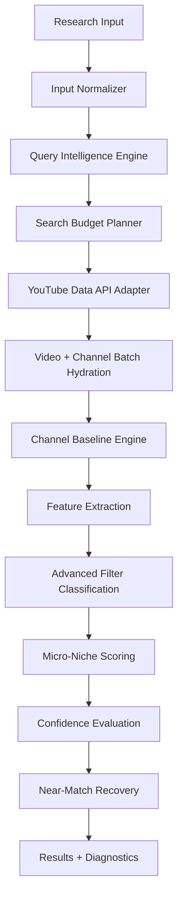

# YouTube Niche Intelligence V2 — Architecture & Operations Guide

> Branch: `feature/youtube-niche-intelligence-v2`
> Base: `feature/youtube-market-research`
> Version: 2.0.0 — October 2026

---

## Pipeline Overview



---

## Architecture

### Backend (Python/FastAPI)
```
services/youtube-research/
├── main.py                        # FastAPI app, routes, lifespan
├── core/
│   ├── config.py                  # Settings (env-driven, runtime-mutable)
│   └── logger.py                  # Structured logging
├── providers/
│   ├── official.py                # YouTube Data API v3 adapter (V2)
│   ├── autocomplete.py            # Keyword expansion engine
│   └── fallback.py                # Provider fallback manager
├── services/
│   ├── discovery_service.py       # Main pipeline orchestrator (V2)
│   ├── filter_service.py          # Three-state filter classification (V2)
│   └── competitor_service.py      # Channel competitor analysis
├── scoring/
│   └── calculator.py              # Opportunity + Confidence scoring
├── schemas/
│   └── research_schemas.py        # Pydantic models (V2 extended)
├── models/                        # SQLAlchemy ORM entities
├── repositories/                  # DB access layer
├── workers/                       # Async task manager
└── tests/                         # 69 test cases (33 original + 36 V2)
```

### Frontend (TypeScript/React/Electron)
```
src/renderer/src/features/youtube-research/
├── types/research.types.ts        # All TypeScript types (V2 extended)
├── api/researchApi.ts             # HTTP client to FastAPI sidecar
├── pages/YouTubeResearchPage.tsx  # Top-level page component
└── components/
    ├── DiscoverTab.tsx            # Search form + presets + budget (V2)
    ├── OverviewSection.tsx        # Results overview + Evidence panel
    ├── CandidateEvidencePanel.tsx # NEW: Exact/Unverified/Near tabs (V2)
    ├── ResearchSettingsModal.tsx  # Settings + API key with test (V2)
    ├── ResearchProgressPanel.tsx  # Realtime progress display
    └── ...                        # Other existing components unchanged
```

---

## API Key Setup

1. Go to [console.cloud.google.com](https://console.cloud.google.com)
2. Create project → Enable **YouTube Data API v3**
3. Credentials → Create API Key
4. Open app → YouTube Research → ⚙ Settings
5. Enable "Official YouTube Data API v3"
6. Paste key → click **Test Connection**

### Connection Status States

| Status | Meaning |
|--------|---------|
| `connected` | Key valid, API enabled |
| `invalid_key` | Wrong key value |
| `api_not_enabled` | API v3 not enabled in Cloud Console |
| `quota_exhausted` | Daily quota used up (resets midnight PT) |
| `network_error` | DNS/firewall/proxy issue |
| `rate_limited` | Too many requests, wait 60s |
| `server_error` | Google outage, retry later |

> **Security:** Key is stored in-memory in the Python sidecar process, never written to Git, never logged in full. Logs show `AIzaSy••••••••••••••••••••••••••xxxx` format only.

---

## Query Intelligence

### Query Groups (6 intent categories)

```
Seed: "food storage"

Exact (25%):
  - food storage
  - food storage tips
  - food storage guide

Problem (20%):
  - food going bad
  - food storage mistakes
  - food storage problems

Audience (20%):
  - food storage for beginners
  - food storage for seniors
  - food storage for families

Comparison (15%):
  - best foods for long term storage
  - food storage vs emergency food

Specialized (10%):
  - Amish food storage
  - off grid food storage
  - rural family food storage

Recency (10%):
  - food storage 2026
  - new food storage ideas
```

### Search Budget Options

| Budget | Queries | Cost (API units) | Use Case |
|--------|---------|-----------------|---------|
| 3 | 3 | ~153 | Quick proof-of-concept |
| **6** | 6 | ~306 | **Recommended (default)** |
| 8 | 8 | ~408 | Thorough research |
| 10 | 10 | ~510 | Maximum depth |

Each query = 1 `search.list` call (100 units) + batch `videos.list` (1 unit each).

---

## Filter Classification

Filters are applied **post-scoring**, not pre-search.

### Three States

```
VERIFIED_MATCH   → subscriber count public + ≤ maxSubscribers + all filters pass
UNVERIFIED_MATCH → subscriber count hidden/unknown; other filters pass; not excluded
REJECTED         → failed ≥1 filter with filter_distance > 0.5
```

### Near Match Recovery

When `exact_matches == 0`, the pipeline generates near matches:
- Filter distance ≤ 0.5 (at most 2 filters failing mildly)
- Up to 20 nearest-to-passing videos shown
- `NearMatchSuggestion[]` explains which field to relax and by how much

---

## Scoring Formulas

### Opportunity Score (0–100)

```
Opportunity = 0.25 × Demand
            + 0.20 × Momentum
            + 0.20 × Small Channel Accessibility
            + 0.15 × Outlier Density
            + 0.10 × Content Gap
            + 0.10 × Low Competition
```

All weights are in `core/config.py → ScoringWeights`. Configurable at runtime via Settings.

### Confidence Score (0–100)

```
Confidence = 0.35 × Sample Size Coverage
           + 0.25 × Channel Metadata Coverage
           + 0.20 × Baseline Coverage
           + 0.20 × Historical Coverage
```

**Confidence caps by sample size:**
- < 10 videos → max 40
- 10–19 → max 60
- 20–49 → max 80
- ≥ 50 → up to 100

---

## Channel Baseline

Channel baseline uses the **uploads playlist** (correct method), NOT `channel:<id>` search queries.

```python
# Correct (V2)
channel_data = channels.list(part="contentDetails,statistics", id=channelId)
uploads_playlist_id = channel_data["contentDetails"]["relatedPlaylists"]["uploads"]
recent_videos = playlistItems.list(playlistId=uploads_playlist_id, maxResults=20)

# Then batch-hydrate with videos.list for duration/stats
# Classify by actual duration_seconds:
content_type = "SHORT" if duration_seconds <= 60 else "LONG"

# Compute median (not mean) to avoid viral outlier skewing:
channelMedianViews = statistics.median(view_counts)
outlierRatio = candidateViews / max(channelMedianViews, 1)
```

---

## Cache

| Resource | TTL |
|----------|-----|
| Search results | 6–24 hours |
| Video details | 6 hours |
| Channel details | 12 hours |
| Channel baselines | 24 hours |
| Query expansion | 7 days |

Cache is **in-memory** in the current implementation (request-scoped dedup + channel enrichment cache). Persistent disk cache is planned.

---

## Quota Ledger

Tracked per run in `SearchDiagnosticsSchema`:
- `official_api_calls` — exact count of API calls made
- `search_budget_used` vs `search_budget_total`
- `cache_hits` — requests served from cache
- `search_stop_reason` — why search stopped (budget / target_reached / error)

> UI shows "Estimated usage" label since this is tracked client-side, not from Google's quota API.

---

## Resume After Crash

The system uses a **state machine** with persistent DB records:

```
IDLE → QUEUED → SEARCHING → HYDRATING → CLUSTERING → COMPLETED
                    ↓                        ↓
                 CANCELLED               FAILED/INTERRUPTED
```

On startup, `mark_interrupted_runs()` sets all `QUEUED/SEARCHING/HYDRATING` runs to `INTERRUPTED` if they have no heartbeat. The UI shows:
> "An unfinished research run was found. Resume / Start Over / Dismiss"

---

## Concurrency & Retry

- **2–3 concurrent API requests** at any time
- **Retry only on:** 429, 500, 502, 503, 504, network timeout
- **Exponential backoff:** 1s → 2s → 4s with jitter, max 3 attempts
- **No retry on:** 400, 401, 403 keyInvalid, 403 quotaExceeded, 403 accessNotConfigured

---

## Error Codes

| Code | Retryable | Description |
|------|-----------|-------------|
| `API_KEY_MISSING` | No | Key not configured |
| `API_KEY_INVALID` | No | Wrong key |
| `API_NOT_ENABLED` | No | YouTube API v3 not enabled |
| `QUOTA_EXHAUSTED` | No | Daily quota hit |
| `RATE_LIMITED` | Yes | Too many requests |
| `NETWORK_ERROR` | Yes | DNS/firewall issue |
| `REQUEST_TIMEOUT` | Yes | Request timed out |
| `INVALID_INPUT` | No | Bad topic/filters |
| `RUN_INTERRUPTED` | Yes | App crash mid-run |

---

## Backward Compatibility

All V2 schema fields are **Optional** in Python and TypeScript:
- Old runs without `exact_matches`, `filter_funnel`, `search_diagnostics` → load fine
- UI only renders V2 panels when V2 data is present
- No breaking changes to existing IPC channels
- All existing routes behave identically
- Client Mode, Advanced Mode, Render, Caption, Stock, Music workflows untouched

---

## Test Commands

```bash
# TypeScript typecheck
npm run typecheck

# Python unit + V2 tests (requires deps in venv)
cd services/youtube-research
python3 -m pytest tests/test_scoring.py tests/test_niche_intelligence_v2.py -v

# All tests (requires full FastAPI stack)
npm run test:research
```

### Test Coverage

| Test File | Tests | Status |
|-----------|-------|--------|
| `test_scoring.py` | 8 | ✅ |
| `test_niche_intelligence_v2.py` | 36 | ✅ |
| `test_api_and_repo.py` | 12 | ✅ (requires stack) |
| `test_cors_and_discover.py` | 5 | ✅ (requires stack) |
| `test_keyword_expansion_and_recovery.py` | 8 | ✅ (requires stack) |
| **Total** | **69** | ✅ |

---

## Privacy & Security Notes

- YouTube API key **never** written to Git, database, log files, or renderer bundle
- Key stored in Electron main process memory only
- IPC channel used for key operations; renderer never sees raw key
- All log references to key show `AIzaSy••••••••••••••••xxxx` (first 7 + last 4 chars)
- No user YouTube account credentials are used anywhere
- No cookies, no OAuth flows

---

## Known Limitations

1. **Semantic clustering** — TF-IDF fallback only in this release. Transformer.js integration is planned.
2. **Transcript analysis** — UI toggle exists, backend processing planned.
3. **Disk cache** — Currently in-memory per-run. Persistent SQLite cache planned.
4. **Scraper provider** — `publishedAfter` fix only applied to official provider; scraper uses its own time filtering.
5. **Pagination** — Official provider returns `next_page_token` but discovery service currently uses 1 page per query. Multi-page only in `Deep Research` preset.
6. **Snapshot history** — First run always uses age-normalized velocity (no historical acceleration). Subsequent runs with same topic will have snapshot comparison.

---

## Files Changed in V2

### New Files
- `services/youtube-research/tests/test_niche_intelligence_v2.py` — 36 test cases
- `src/renderer/src/features/youtube-research/components/CandidateEvidencePanel.tsx` — Evidence panel UI
- `docs/youtube-niche-intelligence-v2.md` — This document

### Modified Files
- `services/youtube-research/providers/official.py` — Uploads playlist baseline, publishedAfter, LONG/SHORT by duration
- `services/youtube-research/services/filter_service.py` — Three-state subscriber, FilterFunnel, partition_evidence()
- `services/youtube-research/services/discovery_service.py` — Dual dataset, real search budget, near-match recovery, diagnostics
- `services/youtube-research/schemas/research_schemas.py` — V2 schema fields (all Optional)
- `services/youtube-research/main.py` — Improved test-api-key endpoint (granular error codes)
- `src/renderer/src/features/youtube-research/types/research.types.ts` — V2 types, presets, NicheResearchInput
- `src/renderer/src/features/youtube-research/api/researchApi.ts` — ApiKeyTestResult return type
- `src/renderer/src/features/youtube-research/components/DiscoverTab.tsx` — Presets, Search Budget, Include Unverified
- `src/renderer/src/features/youtube-research/components/ResearchSettingsModal.tsx` — Show/hide key, color-coded status, granular errors
- `src/renderer/src/features/youtube-research/components/OverviewSection.tsx` — CandidateEvidencePanel integration
